# Diagramas de Flujo - Microservicios Ubik

## 📊 Diagramas Mermaid para la Arquitectura de Microservicios

Este documento contiene todos los diagramas de flujo y secuencia que ilustran el funcionamiento de la plataforma Ubik.

---

## 🏗️ 1. Arquitectura General del Sistema

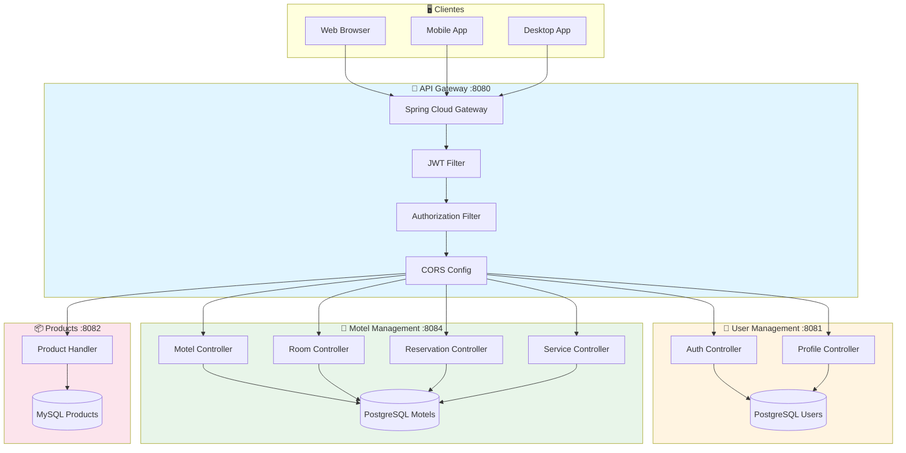

---

## 🔐 2. Flujo de Autenticación Completo

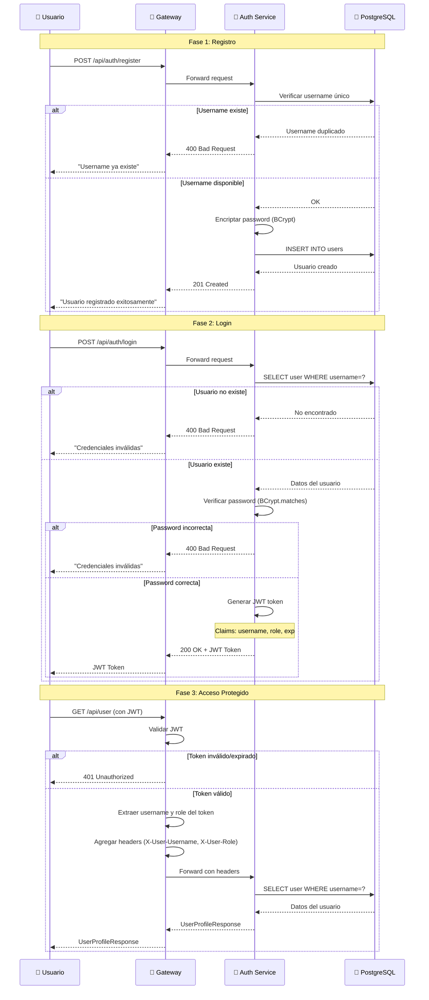

---

## 🏨 3. Flujo de Búsqueda y Reserva de Motel

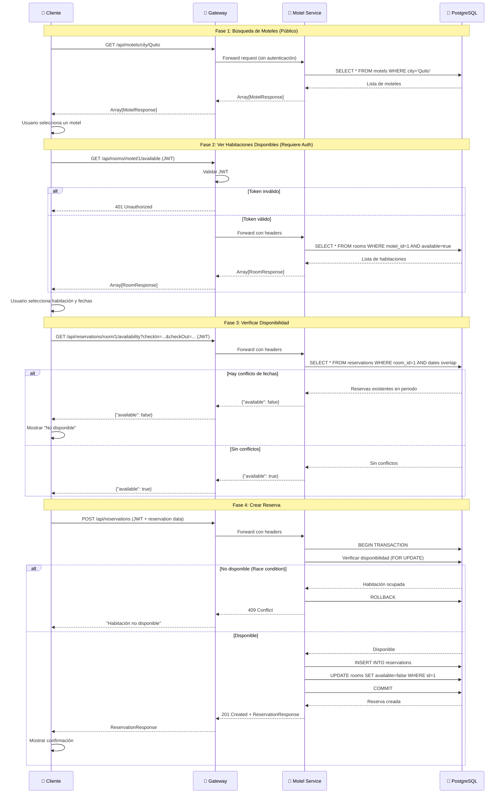

---

## 🔄 4. Flujo de Actualización de Perfil

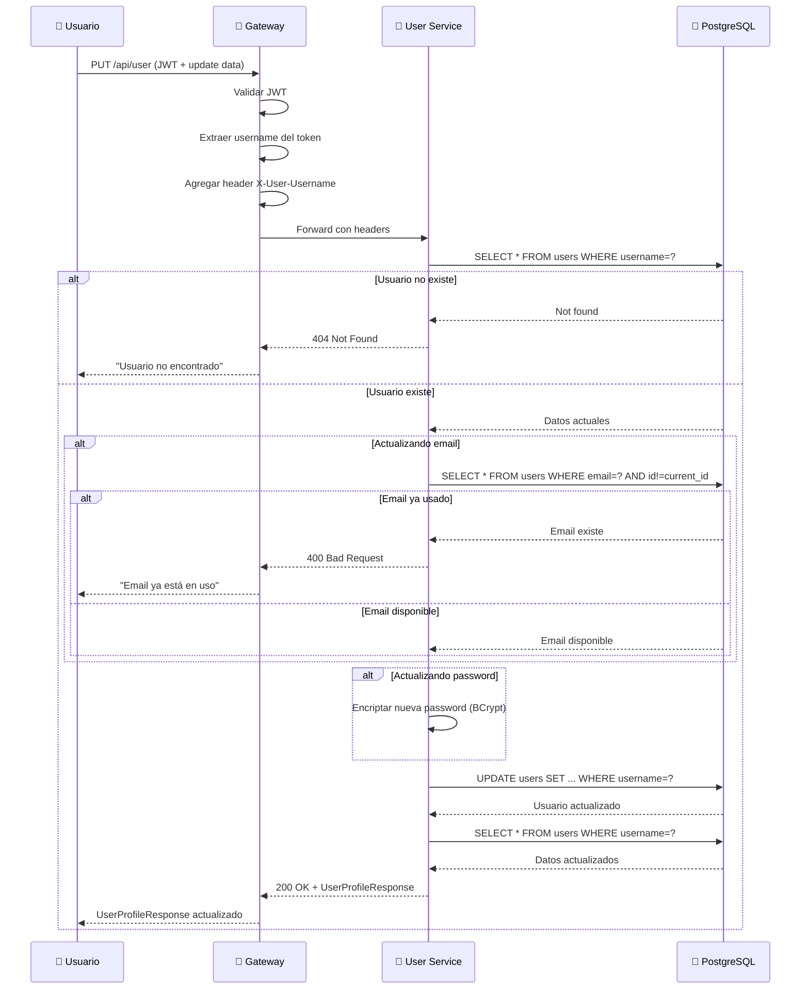

---

## 🔑 5. Flujo de Reseteo de Contraseña

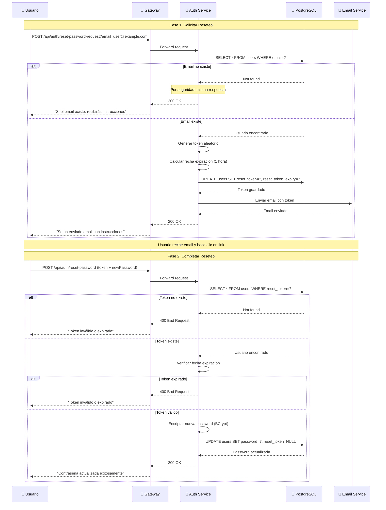

---

## 🏗️ 6. Arquitectura Hexagonal - Motel Management

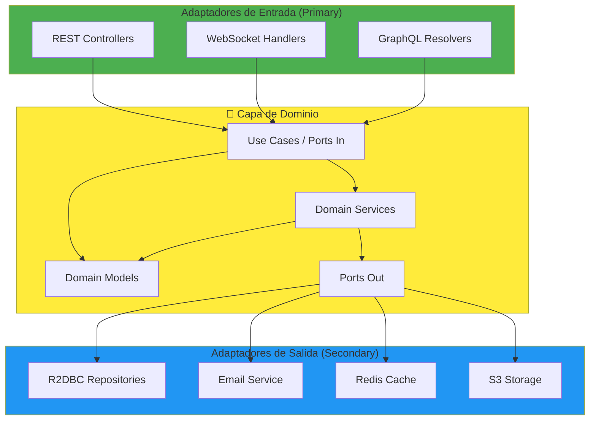

---

## 🔄 7. Flujo de Manejo de Errores

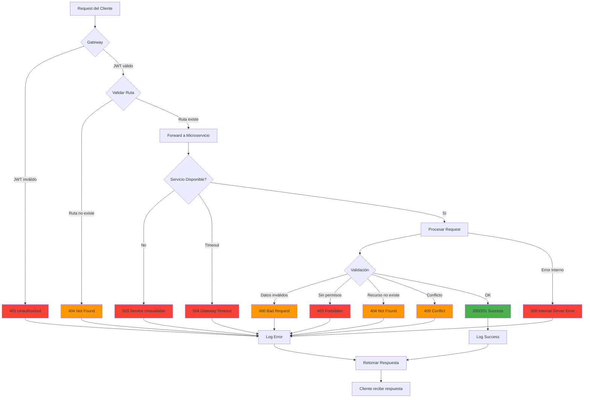

---

## 🔀 8. Flujo de Concurrencia - Double Booking Prevention

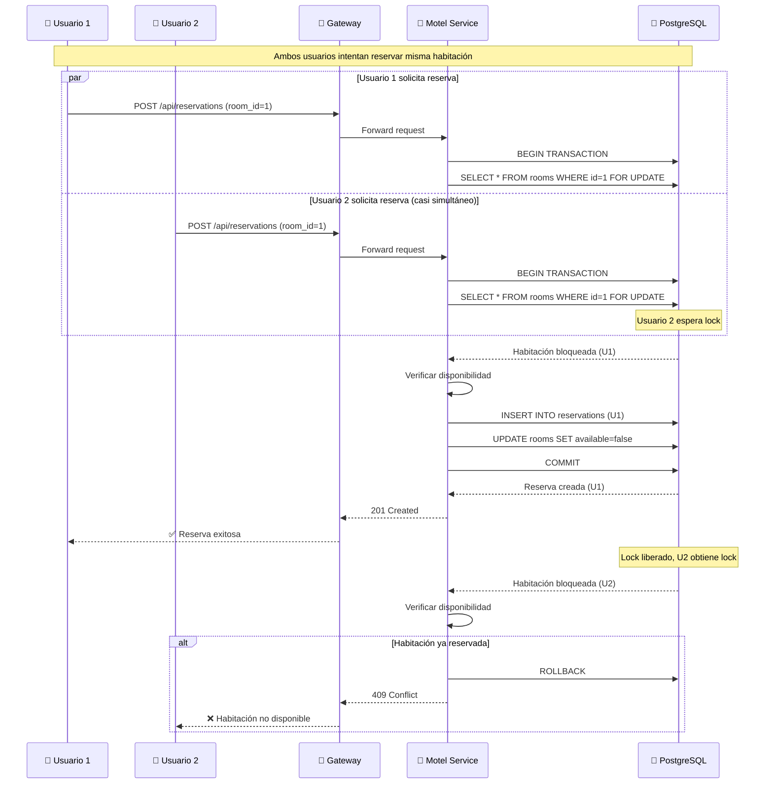

---

## 📊 9. Diagrama de Estados - Reserva

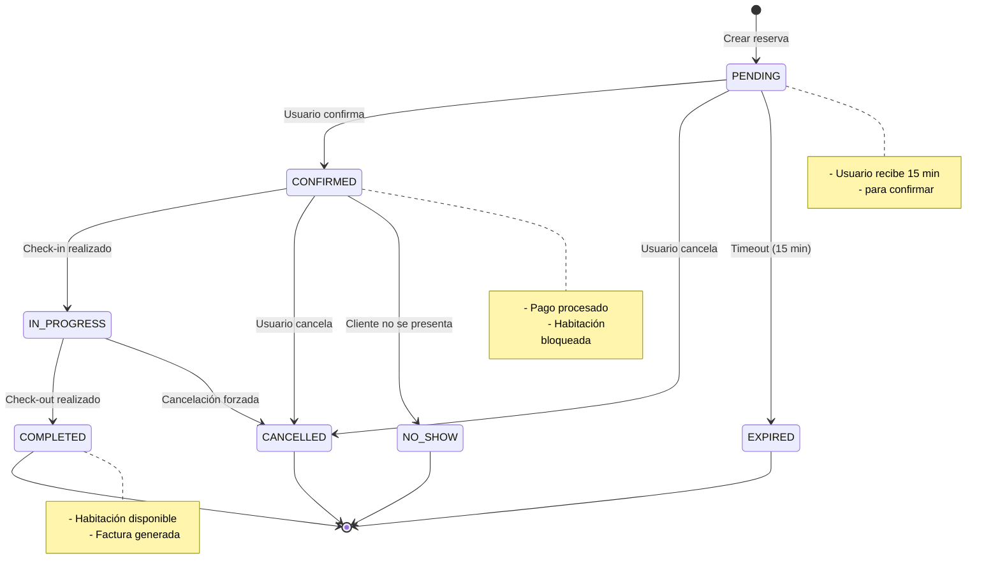

---

## 🔍 10. Flujo de Gateway - Request Processing

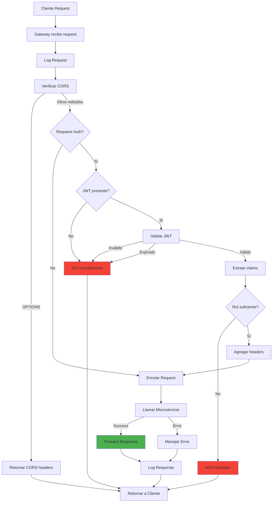

---

## 📈 11. Escalabilidad - Múltiples Instancias

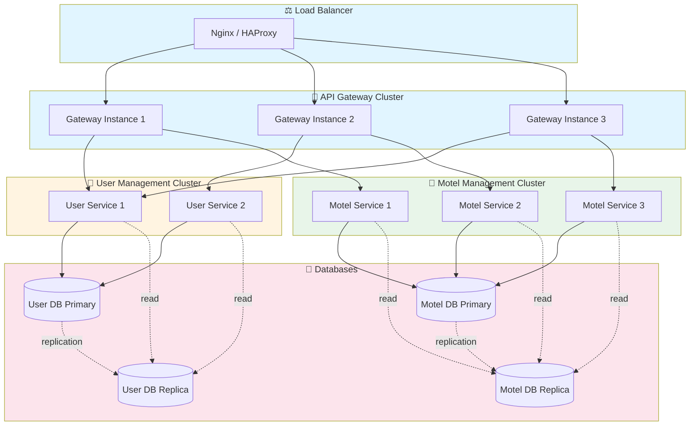

---

## 🔧 12. Diagrama de Despliegue

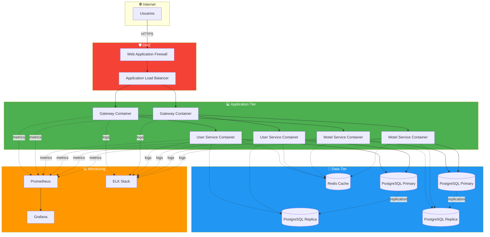

---

**Última actualización:** Diciembre 2024

## 📝 Notas de Uso

- Todos los diagramas son renderizables en GitHub, GitLab y otras plataformas que soporten Mermaid
- Para editar los diagramas, usa el [Mermaid Live Editor](https://mermaid.live/)
- Los diagramas pueden ser exportados como PNG/SVG desde el editor
