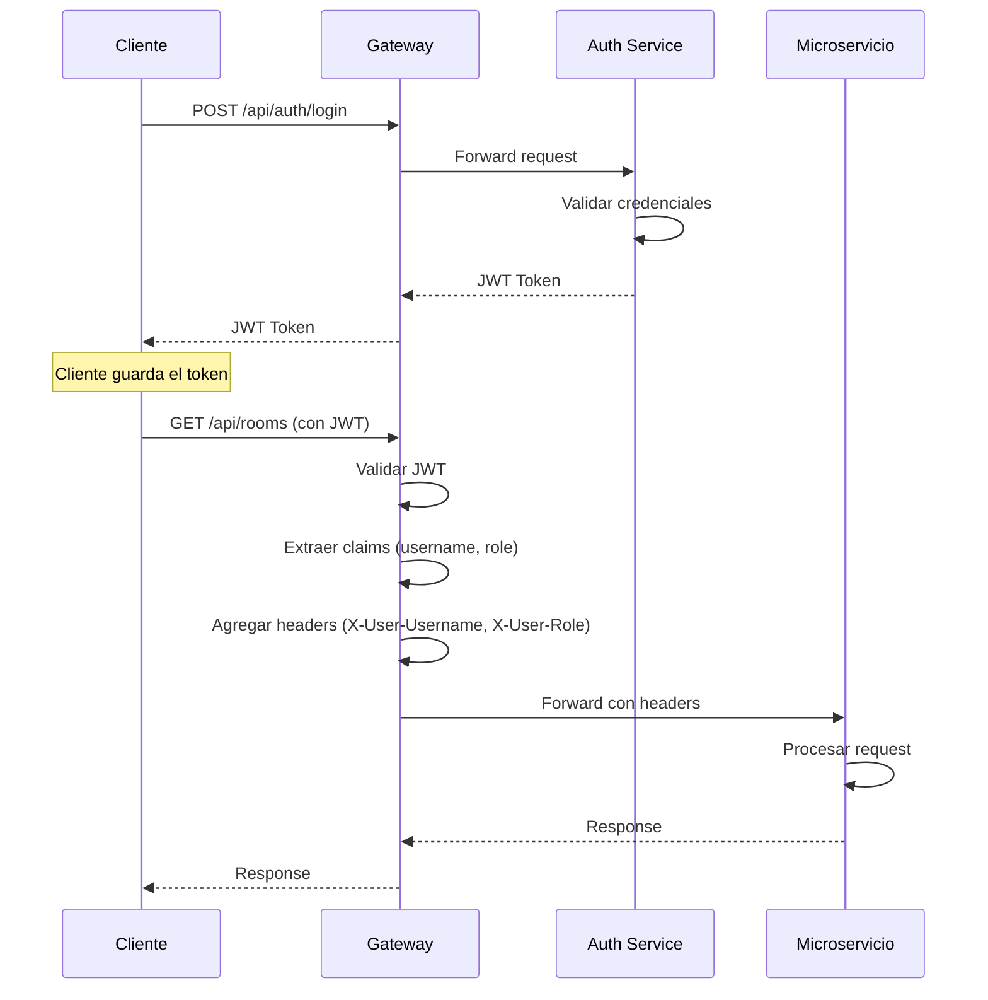

# API Gateway

## 📋 Descripción

API Gateway reactivo construido con Spring Cloud Gateway que actúa como punto de entrada único para todos los microservicios de la plataforma Ubik. Proporciona enrutamiento inteligente, autenticación JWT, autorización basada en roles y manejo de CORS.

## 🚀 Tecnologías

- **Java 17**
- **Spring Boot 3.2.5**
- **Spring Cloud Gateway** - Enrutamiento reactivo
- **Spring Security** - Seguridad reactiva
- **JWT (JJWT 0.12.6)** - Validación de tokens
- **Spring WebFlux** - Framework reactivo

## 🏗️ Arquitectura

```
                                    ┌─────────────────────┐
                                    │   Cliente (Web/     │
                                    │   Mobile/Desktop)   │
                                    └──────────┬──────────┘
                                               │
                                               ▼
                                    ┌──────────────────────┐
                                    │   API Gateway :8080  │
                                    │  ┌────────────────┐  │
                                    │  │ JWT Filter     │  │
                                    │  │ Auth Filter    │  │
                                    │  │ CORS Config    │  │
                                    │  └────────────────┘  │
                                    └───┬──────┬──────┬────┘
                                        │      │      │
                    ┌───────────────────┘      │      └────────────────────┐
                    ▼                          ▼                           ▼
        ┌─────────────────────┐   ┌─────────────────────┐   ┌──────────────────────┐
        │  UserManagement     │   │  MotelManagement    │   │     Products         │
        │     :8081           │   │      :8084          │   │      :8082           │
        │  - Auth             │   │  - Motels           │   │  - CRUD              │
        │  - Users            │   │  - Rooms            │   │                      │
        │                     │   │  - Reservations     │   │                      │
        └─────────────────────┘   └─────────────────────┘   └──────────────────────┘
```

## 📦 Configuración

### Puerto

El Gateway escucha en el puerto **8080** y actúa como proxy reverso para todos los microservicios.

### Variables de Entorno

```bash
export JWT_SECRET=mySecretKey1234567890abcdef1234567890abcdef
export JWT_EXPIRATION=86400000
```

## 🛣️ Rutas Configuradas

### 1. Authentication Service (UserManagement)

#### Rutas Públicas (Sin Autenticación)

```yaml
/api/auth/register    → http://localhost:8081/api/auth/register
/api/auth/login       → http://localhost:8081/api/auth/login
/api/auth/reset-*     → http://localhost:8081/api/auth/reset-*
```

**Ejemplos:**

```bash
# Registro
curl -X POST http://localhost:8080/api/auth/register \
  -H "Content-Type: application/json" \
  -d '{"username": "john", "password": "Pass@123", ...}'

# Login
curl -X POST http://localhost:8080/api/auth/login \
  -H "Content-Type: application/json" \
  -d '{"username": "john", "password": "Pass@123"}'
```

#### Rutas Protegidas (Requieren JWT)

```yaml
/api/user/**          → http://localhost:8081/api/user/**
```

**Ejemplo:**

```bash
curl -X GET http://localhost:8080/api/user \
  -H "Authorization: Bearer <jwt-token>"
```

### 2. Motel Management Service

#### Rutas Públicas

```yaml
/api/motels           → http://localhost:8084/api/motels
/api/motels/{id}      → http://localhost:8084/api/motels/{id}
/api/motels/city/{city} → http://localhost:8084/api/motels/city/{city}
```

**Ejemplo:**

```bash
# Buscar moteles por ciudad (sin autenticación)
curl -X GET http://localhost:8080/api/motels/city/Quito
```

#### Rutas Protegidas

```yaml
/api/rooms/**         → http://localhost:8084/api/rooms/**
/api/services/**      → http://localhost:8084/api/services/**
/api/bookings/**      → http://localhost:8084/api/reservations/**
```

**Ejemplos:**

```bash
# Listar habitaciones (requiere JWT)
curl -X GET http://localhost:8080/api/rooms/motel/1/available \
  -H "Authorization: Bearer <jwt-token>"

# Crear reserva
curl -X POST http://localhost:8080/api/bookings \
  -H "Authorization: Bearer <jwt-token>" \
  -H "Content-Type: application/json" \
  -d '{"roomId": 1, "userId": 5, ...}'
```

### 3. Products Service

```yaml
/api/products/**      → http://localhost:8082/products/**
```

**Ejemplo:**

```bash
curl -X GET http://localhost:8080/api/products \
  -H "Authorization: Bearer <jwt-token>"
```

## 🔐 Autenticación y Autorización

### JWT Authentication Flow



### Headers Agregados por el Gateway

El Gateway automáticamente agrega estos headers a las peticiones autenticadas:

| Header | Descripción | Ejemplo |
|--------|-------------|---------|
| `X-User-Username` | Username del usuario autenticado | "john_doe" |
| `X-User-Role` | Rol del usuario | "CLIENT", "ADMIN", "OWNER" |

Los microservices pueden leer estos headers para identificar al usuario sin validar el JWT nuevamente.

### Authorization Filter

El `AuthorizationFilter` valida:

1. ✅ Presencia del header `Authorization`
2. ✅ Formato del token (`Bearer <token>`)
3. ✅ Validez del JWT (firma, expiración)
4. ✅ Claims requeridos (username, role)

**Rutas que NO requieren autenticación:**

- `/api/auth/**` (excepto algunos endpoints admin)
- `GET /api/motels/**`

**Todas las demás rutas requieren JWT válido.**

## 🌐 CORS Configuration

### Configuración Global

```yaml
globalcors:
  cors-configurations:
    '[/**]':
      allowed-origins: "*"
      allowed-methods:
        - GET
        - POST
        - PUT
        - DELETE
        - OPTIONS
      allowed-headers: "*"
      exposed-headers:
        - X-User-Id
        - X-User-Role
        - X-Error-Message
      allow-credentials: false
      max-age: 3600
```

### Configuración para Producción

```yaml
# application-prod.yml
allowed-origins: 
  - "https://app.ubik.com"
  - "https://admin.ubik.com"
allow-credentials: true
```

## 🔍 Request Logging Filter

El Gateway incluye un filtro de logging que registra:

- 📝 Método HTTP y ruta
- 🔑 Headers (excepto Authorization por seguridad)
- ⏱️ Tiempo de procesamiento
- 📊 Status code de respuesta

```
INFO: [Gateway] GET /api/motels/city/Quito - Status: 200 - Time: 145ms
INFO: [Gateway] POST /api/auth/login - Status: 200 - Time: 523ms
WARN: [Gateway] GET /api/rooms/1 - Status: 401 - Time: 12ms - Missing JWT
```

## ⚠️ Manejo de Errores

### Códigos de Error del Gateway

| Código | Descripción | Causa |
|--------|-------------|-------|
| 401 | Unauthorized | JWT faltante, inválido o expirado |
| 403 | Forbidden | Usuario sin permisos suficientes |
| 404 | Not Found | Ruta no configurada en el Gateway |
| 500 | Internal Server Error | Error en el Gateway |
| 503 | Service Unavailable | Microservicio no disponible |
| 504 | Gateway Timeout | Timeout conectando a microservicio |

### Ejemplos de Respuestas de Error

#### JWT Inválido

```bash
curl -X GET http://localhost:8080/api/rooms \
  -H "Authorization: Bearer invalid-token"

# Respuesta: 401
{
  "error": "Token inválido o expirado"
}
```

#### Servicio No Disponible

```bash
curl -X GET http://localhost:8080/api/rooms \
  -H "Authorization: Bearer <valid-token>"

# Si el servicio de moteles está caído:
# Respuesta: 503
{
  "error": "Servicio temporalmente no disponible"
}
```

## 🧪 Testing del Gateway

### Test de Rutas Públicas

```bash
# Debe funcionar sin token
curl -X GET http://localhost:8080/api/motels
curl -X POST http://localhost:8080/api/auth/login \
  -H "Content-Type: application/json" \
  -d '{"username": "test", "password": "Test@123"}'
```

### Test de Rutas Protegidas

```bash
# Debe fallar sin token
curl -X GET http://localhost:8080/api/rooms
# Respuesta esperada: 401

# Debe funcionar con token válido
TOKEN=$(curl -s -X POST http://localhost:8080/api/auth/login \
  -H "Content-Type: application/json" \
  -d '{"username": "test", "password": "Test@123"}')

curl -X GET http://localhost:8080/api/rooms \
  -H "Authorization: Bearer $TOKEN"
# Respuesta esperada: 200
```

### Test de CORS

```bash
# Preflight request
curl -X OPTIONS http://localhost:8080/api/motels \
  -H "Origin: http://localhost:3000" \
  -H "Access-Control-Request-Method: GET" \
  -v

# Debe incluir en la respuesta:
# Access-Control-Allow-Origin: *
# Access-Control-Allow-Methods: GET, POST, PUT, DELETE, OPTIONS
```

## 📊 Monitoreo

### Actuator Endpoints

```yaml
management:
  endpoints:
    web:
      exposure:
        include: "health,info,metrics,gateway"
```

**Endpoints disponibles:**

- **Health**: `http://localhost:8080/actuator/health`
- **Gateway Routes**: `http://localhost:8080/actuator/gateway/routes`
- **Metrics**: `http://localhost:8080/actuator/metrics`

### Ver Rutas Configuradas

```bash
curl http://localhost:8080/actuator/gateway/routes | jq
```

**Respuesta:**

```json
[
  {
    "route_id": "userManagement-auth",
    "uri": "http://localhost:8081",
    "predicate": "Path=/api/auth/**",
    "filters": ["StripPrefix=0"]
  },
  {
    "route_id": "motel-management-rooms",
    "uri": "http://localhost:8084",
    "predicate": "Path=/api/rooms/**",
    "filters": ["StripPrefix=0", "AuthorizationFilter"]
  }
]
```

## 🔄 Load Balancing (Futuro)

Cuando se integre con Service Discovery (Eureka/Consul):

```yaml
spring:
  cloud:
    gateway:
      routes:
        - id: userManagement-auth
          uri: lb://USER-MANAGEMENT-SERVICE
          predicates:
            - Path=/api/auth/**
```

## 🐳 Docker

```bash
# Build
docker build -t api-gateway:1.0 .

# Run
docker run -p 8080:8080 \
  -e JWT_SECRET=mySecretKey... \
  -e USER_MANAGEMENT_URL=http://host.docker.internal:8081 \
  -e MOTEL_MANAGEMENT_URL=http://host.docker.internal:8084 \
  api-gateway:1.0
```

## 🧩 Integración con Microservicios

### Configuración de URLs

En producción, usar variables de entorno:

```yaml
spring:
  cloud:
    gateway:
      routes:
        - id: userManagement-auth
          uri: ${USER_MANAGEMENT_URL:http://localhost:8081}
```

```bash
export USER_MANAGEMENT_URL=http://user-management-service:8081
export MOTEL_MANAGEMENT_URL=http://motel-management-service:8084
```

## 📈 Performance

### Timeouts

```yaml
spring:
  cloud:
    gateway:
      httpclient:
        connect-timeout: 5000
        response-timeout: 30s
```

### Circuit Breaker (Futuro)

```yaml
spring:
  cloud:
    gateway:
      routes:
        - id: motel-management
          uri: http://localhost:8084
          filters:
            - name: CircuitBreaker
              args:
                name: motelManagementCB
                fallbackUri: forward:/fallback/motel-management
```

## 🔧 Troubleshooting

### Problema: "Connection refused"

**Causa:** Microservicio no está corriendo

**Solución:**
```bash
# Verificar que todos los servicios estén corriendo
curl http://localhost:8081/actuator/health
curl http://localhost:8084/actuator/health
```

### Problema: "JWT inválido" aunque el token es correcto

**Causa:** JWT_SECRET diferente entre Gateway y servicio de autenticación

**Solución:**
```bash
# Asegurar que ambos usen el mismo secret
export JWT_SECRET=mySecretKey1234567890abcdef1234567890abcdef
```

### Problema: CORS errors en el browser

**Causa:** Configuración CORS insuficiente

**Solución:**
Verificar que `allowed-origins` incluya el origen del frontend:
```yaml
allowed-origins: "http://localhost:3000"
```

## 📄 Licencia

Apache 2.0

---

**Última actualización:** Diciembre 2024
