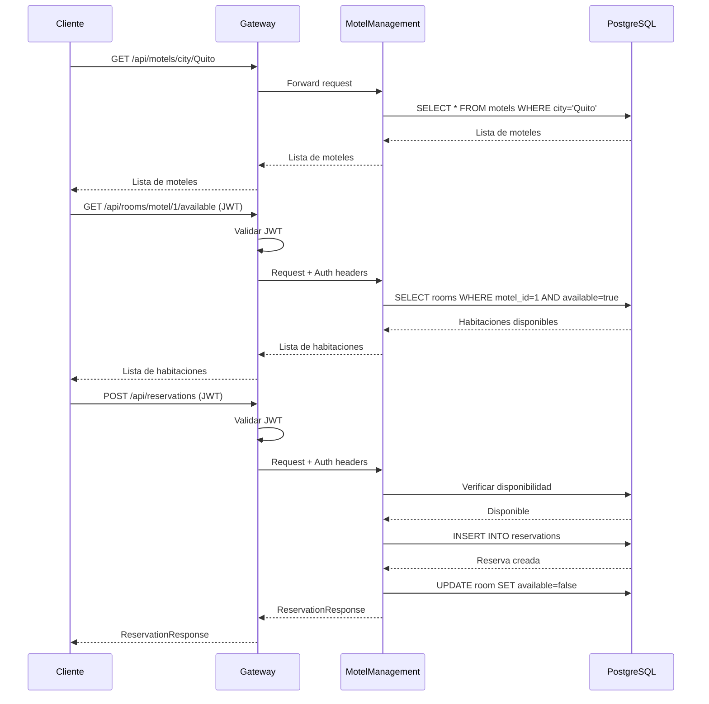

# Motel Management Microservice

## 📋 Descripción

Microservicio reactivo para gestión completa de moteles, habitaciones, servicios y reservas. Construido con Spring Boot 3, Spring WebFlux, R2DBC y PostgreSQL. Proporciona un sistema completo para administrar propiedades hoteleras con soporte para imágenes, servicios adicionales y gestión de disponibilidad.

## 🚀 Tecnologías

- **Java 17**
- **Spring Boot 3.5.3**
- **Spring WebFlux** - Framework reactivo
- **R2DBC PostgreSQL** - Acceso reactivo a base de datos
- **Lombok** - Reducción de código boilerplate
- **Spring Boot Actuator** - Monitoreo y métricas
- **SpringDoc OpenAPI** - Documentación Swagger

## 🏗️ Arquitectura

El microservicio implementa **Arquitectura Hexagonal** (Ports & Adapters):

```
src/main/java/com/ubik/usermanagement/
├── domain/                    # Capa de dominio
│   ├── model/                # Entidades de dominio
│   ├── port/
│   │   ├── in/              # Casos de uso (Use Cases)
│   │   └── out/             # Repositorios
│   └── service/             # Servicios de dominio
└── infrastructure/           # Capa de infraestructura
    ├── adapter/
    │   ├── in/              # Adaptadores de entrada
    │   │   └── web/        # Controllers, DTOs, Mappers
    │   └── out/            # Adaptadores de salida
    │       └── persistence/ # Repositories, Entities
    └── config/              # Configuración
```

## 📦 Instalación y Configuración

### Prerequisitos

- Java 17 o superior
- PostgreSQL 15+
- Maven 3.6+

### 1. Configurar Base de Datos

```sql
CREATE DATABASE motel_management_db;
```

El esquema se inicializa automáticamente al iniciar la aplicación.

### 2. Configurar Variables de Entorno (Opcional)

```bash
export R2DBC_URL=r2dbc:postgresql://localhost:5432/motel_management_db
export R2DBC_USERNAME=postgres
export R2DBC_PASSWORD=carlosmanuel
```

### 3. Ejecutar la Aplicación

```bash
# Desde el directorio del microservicio
./mvnw spring-boot:run

# O compilar y ejecutar el JAR
./mvnw clean package
java -jar target/motel-management-1.0.0-SNAPSHOT.jar
```

La aplicación estará disponible en: **http://localhost:8084**

## 📚 API Documentation

### Swagger UI

Una vez iniciada la aplicación, accede a la documentación interactiva:

**http://localhost:8084/swagger-ui.html**

### OpenAPI Specification

**http://localhost:8084/v3/api-docs**

## 🏨 Endpoints Principales

### 1. Motels API

#### Crear Motel

```http
POST /api/motels
Content-Type: application/json

{
  "name": "Motel Paradise",
  "address": "Av. Principal 123",
  "phoneNumber": "+593-987654321",
  "description": "Motel de lujo con todas las comodidades",
  "city": "Quito",
  "propertyId": 1,
  "imageUrls": [
    "https://example.com/images/motel1.jpg",
    "https://example.com/images/motel2.jpg"
  ]
}
```

#### Listar Todos los Moteles

```http
GET /api/motels
```

#### Obtener Motel por ID

```http
GET /api/motels/{id}
```

#### Buscar Moteles por Ciudad

```http
GET /api/motels/city/Quito
```

#### Actualizar Motel

```http
PUT /api/motels/{id}
Content-Type: application/json

{
  "name": "Motel Paradise Updated",
  "description": "Descripción actualizada con nuevas amenidades",
  "phoneNumber": "+593-999888777"
}
```

#### Eliminar Motel

```http
DELETE /api/motels/{id}
```

### 2. Rooms API

#### Crear Habitación

```http
POST /api/rooms
Authorization: Bearer <jwt-token>
Content-Type: application/json

{
  "motelId": 1,
  "roomNumber": "101",
  "roomType": "SUITE",
  "pricePerHour": 50.00,
  "capacity": 2,
  "description": "Suite de lujo con jacuzzi",
  "available": true,
  "imageUrls": [
    "https://example.com/rooms/suite101-1.jpg",
    "https://example.com/rooms/suite101-2.jpg"
  ],
  "serviceIds": [1, 2, 3]
}
```

**Tipos de habitación disponibles:**
- `STANDARD` - Habitación estándar
- `DELUXE` - Habitación deluxe
- `SUITE` - Suite

#### Listar Habitaciones de un Motel

```http
GET /api/rooms/motel/{motelId}
Authorization: Bearer <jwt-token>
```

#### Buscar Habitaciones Disponibles

```http
GET /api/rooms/motel/{motelId}/available
Authorization: Bearer <jwt-token>
```

#### Obtener Habitación por ID

```http
GET /api/rooms/{id}
Authorization: Bearer <jwt-token>
```

#### Actualizar Habitación

```http
PUT /api/rooms/{id}
Authorization: Bearer <jwt-token>
Content-Type: application/json

{
  "pricePerHour": 60.00,
  "available": true,
  "description": "Suite renovada con nuevas amenidades"
}
```

#### Eliminar Habitación

```http
DELETE /api/rooms/{id}
Authorization: Bearer <jwt-token>
```

### 3. Services API

#### Crear Servicio

```http
POST /api/services
Authorization: Bearer <jwt-token>
Content-Type: application/json

{
  "name": "WiFi",
  "description": "Internet de alta velocidad",
  "price": 5.00
}
```

#### Listar Todos los Servicios

```http
GET /api/services
Authorization: Bearer <jwt-token>
```

#### Obtener Servicio por ID

```http
GET /api/services/{id}
Authorization: Bearer <jwt-token>
```

#### Buscar Servicio por Nombre

```http
GET /api/services/name/WiFi
Authorization: Bearer <jwt-token>
```

#### Actualizar Servicio

```http
PUT /api/services/{id}
Authorization: Bearer <jwt-token>
Content-Type: application/json

{
  "name": "WiFi Premium",
  "price": 10.00
}
```

#### Eliminar Servicio

```http
DELETE /api/services/{id}
Authorization: Bearer <jwt-token>
```

### 4. Reservations API

#### Crear Reserva

```http
POST /api/reservations
Authorization: Bearer <jwt-token>
Content-Type: application/json

{
  "roomId": 1,
  "userId": 5,
  "checkInDate": "2024-12-20T14:00:00",
  "checkOutDate": "2024-12-20T20:00:00",
  "totalPrice": 300.00,
  "status": "PENDING"
}
```

**Estados de reserva disponibles:**
- `PENDING` - Pendiente de confirmación
- `CONFIRMED` - Confirmada
- `CANCELLED` - Cancelada
- `COMPLETED` - Completada

#### Listar Reservas de una Habitación

```http
GET /api/reservations/room/{roomId}
Authorization: Bearer <jwt-token>
```

#### Listar Reservas de un Usuario

```http
GET /api/reservations/user/{userId}
Authorization: Bearer <jwt-token>
```

#### Verificar Disponibilidad

```http
GET /api/reservations/room/{roomId}/availability?checkIn=2024-12-20T14:00:00&checkOut=2024-12-20T20:00:00
Authorization: Bearer <jwt-token>
```

#### Actualizar Reserva

```http
PUT /api/reservations/{id}
Authorization: Bearer <jwt-token>
Content-Type: application/json

{
  "status": "CONFIRMED",
  "checkInDate": "2024-12-20T15:00:00",
  "checkOutDate": "2024-12-20T21:00:00"
}
```

#### Cancelar Reserva

```http
DELETE /api/reservations/{id}
Authorization: Bearer <jwt-token>
```

## 🧪 Ejemplos de Uso

### Flujo Completo de Reserva

```bash
# 1. Obtener JWT token del microservicio de autenticación
TOKEN="tu-jwt-token-aqui"

# 2. Listar moteles disponibles en una ciudad
curl -X GET http://localhost:8084/api/motels/city/Quito

# 3. Ver habitaciones disponibles de un motel
curl -X GET http://localhost:8084/api/rooms/motel/1/available \
  -H "Authorization: Bearer $TOKEN"

# 4. Verificar disponibilidad de una habitación específica
curl -X GET "http://localhost:8084/api/reservations/room/1/availability?checkIn=2024-12-20T14:00:00&checkOut=2024-12-20T20:00:00" \
  -H "Authorization: Bearer $TOKEN"

# 5. Crear una reserva
curl -X POST http://localhost:8084/api/reservations \
  -H "Authorization: Bearer $TOKEN" \
  -H "Content-Type: application/json" \
  -d '{
    "roomId": 1,
    "userId": 5,
    "checkInDate": "2024-12-20T14:00:00",
    "checkOutDate": "2024-12-20T20:00:00",
    "totalPrice": 300.00,
    "status": "PENDING"
  }'

# 6. Confirmar la reserva
curl -X PUT http://localhost:8084/api/reservations/1 \
  -H "Authorization: Bearer $TOKEN" \
  -H "Content-Type: application/json" \
  -d '{
    "status": "CONFIRMED"
  }'
```

### Gestión de Motel y Habitaciones

```bash
TOKEN="tu-jwt-token-aqui"

# Crear un nuevo motel
curl -X POST http://localhost:8084/api/motels \
  -H "Content-Type: application/json" \
  -d '{
    "name": "Motel Sunset",
    "address": "Calle 45 #67-89",
    "phoneNumber": "+593-987123456",
    "description": "Motel acogedor en el centro de la ciudad",
    "city": "Guayaquil",
    "propertyId": 2,
    "imageUrls": [
      "https://example.com/sunset1.jpg"
    ]
  }'

# Crear habitaciones para el motel
curl -X POST http://localhost:8084/api/rooms \
  -H "Authorization: Bearer $TOKEN" \
  -H "Content-Type: application/json" \
  -d '{
    "motelId": 2,
    "roomNumber": "201",
    "roomType": "DELUXE",
    "pricePerHour": 40.00,
    "capacity": 3,
    "description": "Habitación deluxe con vista a la ciudad",
    "available": true,
    "imageUrls": ["https://example.com/room201.jpg"],
    "serviceIds": [1, 2]
  }'

# Listar todas las habitaciones del motel
curl -X GET http://localhost:8084/api/rooms/motel/2 \
  -H "Authorization: Bearer $TOKEN"
```

### JavaScript (Fetch API)

```javascript
const API_BASE = 'http://localhost:8084';
const token = localStorage.getItem('jwt-token');

// Buscar moteles en una ciudad
async function searchMotels(city) {
  const response = await fetch(`${API_BASE}/api/motels/city/${city}`);
  return await response.json();
}

// Obtener habitaciones disponibles
async function getAvailableRooms(motelId) {
  const response = await fetch(
    `${API_BASE}/api/rooms/motel/${motelId}/available`,
    {
      headers: {
        'Authorization': `Bearer ${token}`
      }
    }
  );
  return await response.json();
}

// Crear una reserva
async function createReservation(reservationData) {
  const response = await fetch(`${API_BASE}/api/reservations`, {
    method: 'POST',
    headers: {
      'Authorization': `Bearer ${token}`,
      'Content-Type': 'application/json'
    },
    body: JSON.stringify(reservationData)
  });
  return await response.json();
}

// Uso
const motels = await searchMotels('Quito');
const rooms = await getAvailableRooms(motels[0].id);
const reservation = await createReservation({
  roomId: rooms[0].id,
  userId: 5,
  checkInDate: '2024-12-20T14:00:00',
  checkOutDate: '2024-12-20T20:00:00',
  totalPrice: 300.00,
  status: 'PENDING'
});
```

## 🔄 Flujo de Reserva



## 📊 Base de Datos

### Esquema Principal

```sql
-- Tabla de Moteles
CREATE TABLE motels (
    id SERIAL PRIMARY KEY,
    name VARCHAR(100) NOT NULL,
    address VARCHAR(255) NOT NULL,
    phone_number VARCHAR(20),
    description VARCHAR(500),
    city VARCHAR(100) NOT NULL,
    property_id BIGINT,
    created_at TIMESTAMP DEFAULT CURRENT_TIMESTAMP,
    updated_at TIMESTAMP DEFAULT CURRENT_TIMESTAMP
);

-- Tabla de Imágenes de Moteles
CREATE TABLE motel_images (
    id SERIAL PRIMARY KEY,
    motel_id BIGINT NOT NULL REFERENCES motels(id) ON DELETE CASCADE,
    image_url VARCHAR(500) NOT NULL,
    created_at TIMESTAMP DEFAULT CURRENT_TIMESTAMP
);

-- Tabla de Habitaciones
CREATE TABLE rooms (
    id SERIAL PRIMARY KEY,
    motel_id BIGINT NOT NULL REFERENCES motels(id) ON DELETE CASCADE,
    room_number VARCHAR(20) NOT NULL,
    room_type VARCHAR(50) NOT NULL,
    price_per_hour DECIMAL(10,2) NOT NULL,
    capacity INTEGER NOT NULL,
    description VARCHAR(500),
    available BOOLEAN DEFAULT true,
    created_at TIMESTAMP DEFAULT CURRENT_TIMESTAMP,
    updated_at TIMESTAMP DEFAULT CURRENT_TIMESTAMP,
    UNIQUE(motel_id, room_number)
);

-- Tabla de Servicios
CREATE TABLE services (
    id SERIAL PRIMARY KEY,
    name VARCHAR(100) UNIQUE NOT NULL,
    description VARCHAR(255),
    price DECIMAL(10,2) NOT NULL,
    created_at TIMESTAMP DEFAULT CURRENT_TIMESTAMP
);

-- Tabla de Reservas
CREATE TABLE reservations (
    id SERIAL PRIMARY KEY,
    room_id BIGINT NOT NULL REFERENCES rooms(id),
    user_id BIGINT NOT NULL,
    check_in_date TIMESTAMP NOT NULL,
    check_out_date TIMESTAMP NOT NULL,
    total_price DECIMAL(10,2) NOT NULL,
    status VARCHAR(20) NOT NULL,
    created_at TIMESTAMP DEFAULT CURRENT_TIMESTAMP,
    updated_at TIMESTAMP DEFAULT CURRENT_TIMESTAMP
);
```

## ⚠️ Manejo de Errores

### Códigos de Estado HTTP

| Código | Descripción | Ejemplo |
|--------|-------------|---------|
| 200 | OK | Operación exitosa |
| 201 | Created | Recurso creado exitosamente |
| 204 | No Content | Eliminación exitosa |
| 400 | Bad Request | Datos inválidos o validación fallida |
| 401 | Unauthorized | Token JWT inválido o faltante |
| 404 | Not Found | Recurso no encontrado |
| 409 | Conflict | Conflicto (ej: doble reserva) |
| 500 | Internal Server Error | Error del servidor |

## 🔒 Seguridad y Autenticación

La mayoría de los endpoints requieren autenticación JWT excepto:
- `GET /api/motels` - Listar moteles
- `GET /api/motels/{id}` - Ver detalles de motel
- `GET /api/motels/city/{city}` - Buscar por ciudad

Todos los demás endpoints requieren el header:
```
Authorization: Bearer <jwt-token>
```

## 🧩 Integración con Gateway

```
Cliente → Gateway (8080) → MotelManagement (8084)
```

Rutas configuradas en el Gateway:
- `/api/motels/**` → Sin autenticación
- `/api/rooms/**` → Con autenticación
- `/api/services/**` → Con autenticación
- `/api/reservations/**` → Con autenticación

## 📊 Monitoreo con Actuator

Endpoints de Actuator disponibles:

- **Health**: `http://localhost:8084/actuator/health`
- **Info**: `http://localhost:8084/actuator/info`
- **Metrics**: `http://localhost:8084/actuator/metrics`

## 🧪 Testing

```bash
# Ejecutar tests
./mvnw test

# Tests de integración
./mvnw verify

# Generar reporte de cobertura
./mvnw jacoco:report
```

## 🐳 Docker

```bash
# Build
docker build -t motel-management:1.0 .

# Run
docker run -p 8084:8084 \
  -e R2DBC_URL=r2dbc:postgresql://host.docker.internal:5432/motel_management_db \
  -e R2DBC_USERNAME=postgres \
  -e R2DBC_PASSWORD=carlosmanuel \
  motel-management:1.0
```

## 📄 Licencia

Apache 2.0

## 👥 Contacto

Ubik Team - support@ubik.com

---

**Última actualización:** Diciembre 2024
