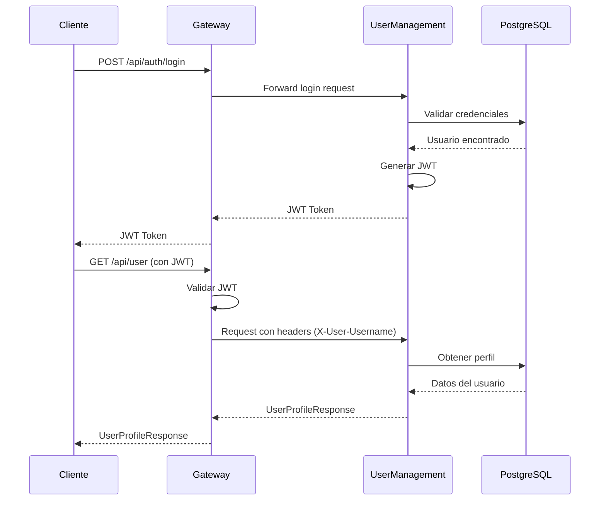

# User Management Microservice

## 📋 Descripción

Microservicio reactivo para gestión de usuarios y autenticación JWT construido con Spring Boot 3, Spring WebFlux, R2DBC y PostgreSQL. Implementa un sistema completo de autenticación con soporte para múltiples roles (Admin, Client, Owner).

## 🚀 Tecnologías

- **Java 17**
- **Spring Boot 3.5.3**
- **Spring WebFlux** - Framework reactivo
- **Spring Security** - Seguridad reactiva
- **R2DBC PostgreSQL** - Acceso reactivo a base de datos
- **JWT (JJWT 0.12.6)** - Tokens de autenticación
- **Lombok** - Reducción de código boilerplate
- **SpringDoc OpenAPI** - Documentación Swagger

## 🏗️ Arquitectura

El microservicio implementa **Arquitectura Hexagonal** (Ports & Adapters):

```
src/main/java/com/ubik/usermanagement/
├── application/                # Capa de aplicación
│   ├── port/                  # Puertos (interfaces)
│   │   ├── in/               # Casos de uso
│   │   └── out/              # Repositorios y servicios externos
│   └── usecase/              # Implementación de casos de uso
├── domain/                    # Capa de dominio
│   └── model/                # Entidades de dominio
└── infrastructure/           # Capa de infraestructura
    ├── adapter/
    │   ├── in/              # Adaptadores de entrada (Controllers, Filters)
    │   └── out/             # Adaptadores de salida (Repositories, JWT)
    └── config/              # Configuración (Security, OpenAPI)
```

## 📦 Instalación y Configuración

### Prerequisitos

- Java 17 o superior
- PostgreSQL 15+
- Maven 3.6+

### 1. Configurar Base de Datos

Crear la base de datos en PostgreSQL:

```sql
CREATE DATABASE userManagement_db;
```

El esquema se inicializa automáticamente al iniciar la aplicación.

### 2. Configurar Variables de Entorno (Opcional)

```bash
export R2DBC_URL=r2dbc:postgresql://localhost:5432/userManagement_db
export R2DBC_USERNAME=postgres
export R2DBC_PASSWORD=12345
export JWT_SECRET=mySecretKey1234567890abcdef1234567890abcdef
```

### 3. Ejecutar la Aplicación

```bash
# Desde el directorio del microservicio
./mvnw spring-boot:run

# O compilar y ejecutar el JAR
./mvnw clean package
java -jar target/user-management-1.0.0-SNAPSHOT.jar
```

La aplicación estará disponible en: **http://localhost:8081**

## 📚 API Documentation

### Swagger UI

Una vez iniciada la aplicación, accede a la documentación interactiva:

**http://localhost:8081/swagger-ui.html**

### OpenAPI Specification

**http://localhost:8081/v3/api-docs**

## 🔑 Endpoints Principales

### Authentication Endpoints

#### 1. Registrar Usuario

```http
POST /api/auth/register
Content-Type: application/json

{
  "username": "john_doe",
  "password": "SecureP@ss123",
  "email": "john@example.com",
  "anonymous": false,
  "roleId": 1
}
```

**Roles disponibles:**
- `1` - CLIENT (Cliente)
- `2` - ADMIN (Administrador)
- `3` - OWNER (Propietario de motel)

**Respuesta exitosa (201):**
```
Usuario registrado exitosamente
```

#### 2. Login

```http
POST /api/auth/login
Content-Type: application/json

{
  "username": "john_doe",
  "password": "SecureP@ss123"
}
```

**Respuesta exitosa (200):**
```
eyJhbGciOiJIUzI1NiIsInR5cCI6IkpXVCJ9.eyJzdWIiOiJqb2huX2RvZSIsInJvbGUiOiJDTElFTlQifQ...
```

💡 **Importante:** Guarda este token JWT, lo necesitarás para endpoints protegidos.

#### 3. Solicitar Reseteo de Contraseña

```http
POST /api/auth/reset-password-request?email=john@example.com
```

**Respuesta exitosa (200):**
```
Se ha enviado un email con instrucciones para resetear la contraseña
```

#### 4. Resetear Contraseña

```http
POST /api/auth/reset-password
Content-Type: application/json

{
  "token": "abc123xyz789",
  "newPassword": "NewSecureP@ss456"
}
```

### User Profile Endpoints (Requieren Autenticación)

#### 5. Obtener Perfil de Usuario

```http
GET /api/user
Authorization: Bearer <tu-jwt-token>
```

**Respuesta exitosa (200):**
```json
{
  "id": 1,
  "username": "john_doe",
  "email": "john@example.com",
  "roleId": 1,
  "roleName": "CLIENT",
  "anonymous": false,
  "createdAt": "2024-01-15T10:30:00"
}
```

#### 6. Actualizar Perfil

```http
PUT /api/user
Authorization: Bearer <tu-jwt-token>
Content-Type: application/json

{
  "email": "newemail@example.com",
  "password": "NewSecureP@ss789"
}
```

## 🧪 Ejemplos de Uso con cURL

### Flujo Completo de Autenticación

```bash
# 1. Registrar nuevo usuario
curl -X POST http://localhost:8081/api/auth/register \
  -H "Content-Type: application/json" \
  -d '{
    "username": "test_user",
    "password": "Test@1234",
    "email": "test@example.com",
    "anonymous": false,
    "roleId": 1
  }'

# 2. Login para obtener JWT
TOKEN=$(curl -X POST http://localhost:8081/api/auth/login \
  -H "Content-Type: application/json" \
  -d '{
    "username": "test_user",
    "password": "Test@1234"
  }')

echo "Token obtenido: $TOKEN"

# 3. Obtener perfil (requiere JWT)
curl -X GET http://localhost:8081/api/user \
  -H "Authorization: Bearer $TOKEN"

# 4. Actualizar perfil
curl -X PUT http://localhost:8081/api/user \
  -H "Authorization: Bearer $TOKEN" \
  -H "Content-Type: application/json" \
  -d '{
    "email": "updated@example.com",
    "password": "NewPassword@5678"
  }'
```

### Ejemplos con JavaScript (Fetch API)

```javascript
// Login y guardar token
async function login(username, password) {
  const response = await fetch('http://localhost:8081/api/auth/login', {
    method: 'POST',
    headers: {
      'Content-Type': 'application/json',
    },
    body: JSON.stringify({ username, password })
  });
  
  const token = await response.text();
  localStorage.setItem('jwt-token', token);
  return token;
}

// Obtener perfil de usuario
async function getUserProfile() {
  const token = localStorage.getItem('jwt-token');
  
  const response = await fetch('http://localhost:8081/api/user', {
    headers: {
      'Authorization': `Bearer ${token}`
    }
  });
  
  return await response.json();
}

// Uso
const token = await login('john_doe', 'SecureP@ss123');
const profile = await getUserProfile();
console.log(profile);
```

## 🔐 Seguridad

### JWT (JSON Web Tokens)

Los tokens JWT generados tienen las siguientes características:

- **Algoritmo**: HS256 (HMAC-SHA256)
- **Validez**: 24 horas (86400000 ms)
- **Claims incluidos**:
  - `sub`: Username del usuario
  - `role`: Rol del usuario (CLIENT, ADMIN, OWNER)
  - `iat`: Timestamp de emisión
  - `exp`: Timestamp de expiración

### Roles y Permisos

| Rol | ID | Descripción | Permisos |
|-----|-------|-------------|----------|
| CLIENT | 1 | Cliente regular | Acceso a endpoints de usuario |
| ADMIN | 2 | Administrador | Acceso completo al sistema |
| OWNER | 3 | Propietario | Gestión de moteles propios |

### Encriptación de Contraseñas

- Algoritmo: **BCrypt**
- Strength: **12 rounds**

## ⚠️ Manejo de Errores

### Códigos de Estado HTTP

| Código | Descripción | Ejemplo |
|--------|-------------|---------|
| 200 | OK | Login exitoso |
| 201 | Created | Usuario registrado |
| 400 | Bad Request | Datos inválidos o usuario duplicado |
| 401 | Unauthorized | Token inválido o expirado |
| 403 | Forbidden | Sin permisos suficientes |
| 404 | Not Found | Usuario no encontrado |
| 500 | Internal Server Error | Error del servidor |

### Formato de Errores

```json
{
  "error": "Error: El username ya está en uso"
}
```

## 🧩 Integración con Gateway

El microservicio está diseñado para funcionar detrás del API Gateway en el puerto 8080:

```
Cliente → Gateway (8080) → UserManagement (8081)
```

### Headers Agregados por Gateway

El Gateway agrega los siguientes headers a las peticiones autenticadas:

- `X-User-Username`: Username del usuario autenticado
- `X-User-Role`: Rol del usuario

## 🔄 Flujo de Autenticación



## 📊 Base de Datos

### Esquema de Tabla `users`

```sql
CREATE TABLE users (
    id SERIAL PRIMARY KEY,
    username VARCHAR(50) UNIQUE NOT NULL,
    email VARCHAR(100) UNIQUE NOT NULL,
    password VARCHAR(255) NOT NULL,
    role_id INTEGER NOT NULL,
    anonymous BOOLEAN DEFAULT false,
    reset_token VARCHAR(255),
    reset_token_expiry TIMESTAMP,
    created_at TIMESTAMP DEFAULT CURRENT_TIMESTAMP,
    updated_at TIMESTAMP DEFAULT CURRENT_TIMESTAMP
);
```

## 🧪 Testing

```bash
# Ejecutar tests unitarios
./mvnw test

# Ejecutar tests de integración
./mvnw verify

# Generar reporte de cobertura
./mvnw jacoco:report
```

## 📝 Logs

La aplicación genera logs detallados para debugging:

```yaml
logging:
  level:
    com.ubik.usermanagement: DEBUG
    org.springframework.security: DEBUG
    org.springframework.r2dbc: DEBUG
```

## 🐳 Docker

```dockerfile
FROM eclipse-temurin:17-jre-alpine
WORKDIR /app
COPY target/*.jar app.jar
EXPOSE 8081
ENTRYPOINT ["java", "-jar", "app.jar"]
```

```bash
# Build imagen
docker build -t user-management:1.0 .

# Ejecutar contenedor
docker run -p 8081:8081 \
  -e R2DBC_URL=r2dbc:postgresql://host.docker.internal:5432/userManagement_db \
  -e R2DBC_USERNAME=postgres \
  -e R2DBC_PASSWORD=12345 \
  user-management:1.0
```

## 🤝 Contribuir

1. Fork el proyecto
2. Crea una rama para tu feature (`git checkout -b feature/AmazingFeature`)
3. Commit tus cambios (`git commit -m 'Add some AmazingFeature'`)
4. Push a la rama (`git push origin feature/AmazingFeature`)
5. Abre un Pull Request

## 📄 Licencia

Apache 2.0

## 👥 Contacto

Ubik Team - support@ubik.com

---

**Última actualización:** Diciembre 2024
